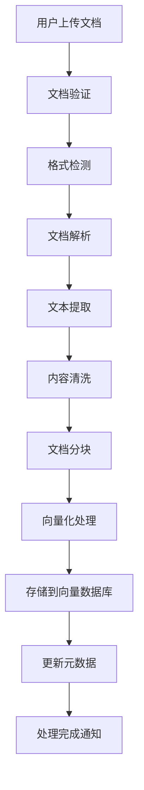
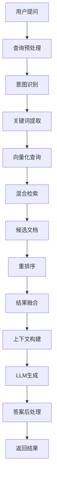

# 系统架构文档

医疗文献RAG系统采用现代化的微服务架构设计，支持高并发、高可用和可扩展的智能问答服务。

## 整体架构

### 系统架构图

```
┌─────────────────────────────────────────────────────────────────┐
│                        用户界面层                                │
├─────────────────────────────────────────────────────────────────┤
│  Web UI (React)     │  Mobile App     │  API Clients           │
└─────────────────────────────────────────────────────────────────┘
                                │
                                ▼
┌─────────────────────────────────────────────────────────────────┐
│                        API网关层                                │
├─────────────────────────────────────────────────────────────────┤
│  FastAPI Gateway    │  认证授权       │  限流熔断               │
└─────────────────────────────────────────────────────────────────┘
                                │
                                ▼
┌─────────────────────────────────────────────────────────────────┐
│                        应用服务层                                │
├─────────────────────────────────────────────────────────────────┤
│  文档管理服务       │  检索服务       │  问答服务               │
│  会话管理服务       │  用户管理服务   │  监控服务               │
└─────────────────────────────────────────────────────────────────┘
                                │
                                ▼
┌─────────────────────────────────────────────────────────────────┐
│                        数据处理层                                │
├─────────────────────────────────────────────────────────────────┤
│  文档解析引擎       │  向量化引擎     │  检索引擎               │
│  NLP处理引擎        │  缓存引擎       │  队列引擎               │
└─────────────────────────────────────────────────────────────────┘
                                │
                                ▼
┌─────────────────────────────────────────────────────────────────┐
│                        数据存储层                                │
├─────────────────────────────────────────────────────────────────┤
│  PostgreSQL         │  Chroma DB      │  Redis                  │
│  文件存储           │  日志存储       │  配置存储               │
└─────────────────────────────────────────────────────────────────┘
                                │
                                ▼
┌─────────────────────────────────────────────────────────────────┐
│                        外部服务层                                │
├─────────────────────────────────────────────────────────────────┤
│  OpenAI API         │  本地LLM        │  监控告警               │
│  邮件服务           │  对象存储       │  日志分析               │
└─────────────────────────────────────────────────────────────────┘
```

### 核心组件

#### 1. 用户界面层
- **Web UI**: 基于React的现代化Web界面
- **移动端**: 响应式设计，支持移动设备访问
- **API客户端**: 支持第三方系统集成

#### 2. API网关层
- **FastAPI网关**: 统一API入口，路由分发
- **认证授权**: JWT令牌验证，RBAC权限控制
- **限流熔断**: 防止系统过载，保障服务稳定

#### 3. 应用服务层
- **文档管理服务**: 文档上传、处理、存储管理
- **检索服务**: 混合检索、向量搜索、结果融合
- **问答服务**: 智能问答、流式响应、上下文管理
- **会话管理服务**: 对话历史、会话状态管理
- **监控服务**: 系统监控、性能分析、告警通知

#### 4. 数据处理层
- **文档解析引擎**: PDF、Word、HTML等格式解析
- **向量化引擎**: 文本嵌入、向量生成
- **检索引擎**: 语义检索、关键词检索、混合检索
- **NLP处理引擎**: 文本预处理、实体识别、关键词提取
- **缓存引擎**: 查询缓存、结果缓存
- **队列引擎**: 异步任务处理、消息队列

#### 5. 数据存储层
- **PostgreSQL**: 关系型数据存储
- **Chroma DB**: 向量数据库
- **Redis**: 缓存和会话存储
- **文件存储**: 文档文件存储
- **日志存储**: 系统日志和审计日志

## 技术栈

### 后端技术

| 组件 | 技术选型 | 版本 | 说明 |
|------|----------|------|------|
| Web框架 | FastAPI | 0.104+ | 高性能异步Web框架 |
| 数据库 | PostgreSQL | 14+ | 关系型数据库 |
| 向量数据库 | Chroma | 0.4+ | 向量存储和检索 |
| 缓存 | Redis | 7+ | 内存缓存和会话存储 |
| 消息队列 | Celery | 5.3+ | 异步任务处理 |
| ORM | SQLAlchemy | 2.0+ | 数据库ORM |
| 数据验证 | Pydantic | 2.0+ | 数据模型和验证 |
| 异步支持 | asyncio | 内置 | 异步编程支持 |
| HTTP客户端 | httpx | 0.25+ | 异步HTTP客户端 |
| 日志 | structlog | 23+ | 结构化日志 |

### AI/ML技术

| 组件 | 技术选型 | 版本 | 说明 |
|------|----------|------|------|
| LLM服务 | OpenAI API | GPT-3.5/4 | 大语言模型 |
| 本地LLM | Ollama | 0.1+ | 本地模型部署 |
| 嵌入模型 | OpenAI Embeddings | text-embedding-ada-002 | 文本向量化 |
| 文档解析 | PyMuPDF | 1.23+ | PDF文档解析 |
| 文本处理 | spaCy | 3.7+ | NLP文本处理 |
| 向量检索 | FAISS | 1.7+ | 高效向量检索 |

### 前端技术

| 组件 | 技术选型 | 版本 | 说明 |
|------|----------|------|------|
| 框架 | React | 18+ | 用户界面框架 |
| 构建工具 | Vite | 5+ | 前端构建工具 |
| 状态管理 | Zustand | 4+ | 轻量级状态管理 |
| UI组件 | Ant Design | 5+ | UI组件库 |
| HTTP客户端 | Axios | 1.6+ | HTTP请求库 |
| 路由 | React Router | 6+ | 前端路由 |
| 样式 | Tailwind CSS | 3+ | CSS框架 |
| 图标 | Lucide React | 0.3+ | 图标库 |

### 开发工具

| 工具 | 技术选型 | 说明 |
|------|----------|------|
| 代码格式化 | Black, Prettier | 代码格式化 |
| 代码检查 | Flake8, ESLint | 代码质量检查 |
| 类型检查 | mypy, TypeScript | 静态类型检查 |
| 测试框架 | pytest, Jest | 单元测试和集成测试 |
| 容器化 | Docker | 应用容器化 |
| 编排 | Docker Compose | 本地开发环境 |

## 数据流架构

### 文档处理流程



**详细步骤说明**:

1. **文档验证**: 检查文件格式、大小、权限
2. **格式检测**: 识别PDF、Word、HTML等格式
3. **文档解析**: 使用相应解析器提取内容
4. **文本提取**: 提取纯文本、表格、图片信息
5. **内容清洗**: 去除噪声、格式化文本
6. **文档分块**: 按语义边界分割文档
7. **向量化处理**: 生成文本嵌入向量
8. **存储**: 保存向量和元数据
9. **通知**: 更新处理状态

### 检索问答流程



**详细步骤说明**:

1. **查询预处理**: 文本清洗、标准化
2. **意图识别**: 分析查询类型和意图
3. **关键词提取**: 提取重要关键词
4. **向量化查询**: 生成查询向量
5. **混合检索**: 结合语义和关键词检索
6. **候选文档**: 获取相关文档片段
7. **重排序**: 使用重排序模型优化结果
8. **结果融合**: RRF算法融合多路检索结果
9. **上下文构建**: 构建LLM输入上下文
10. **LLM生成**: 生成智能回答
11. **答案后处理**: 格式化、引用标注
12. **返回结果**: 返回最终答案

## 核心算法

### 混合检索算法

系统采用混合检索策略，结合多种检索方法：

#### 1. 语义检索 (Dense Retrieval)
```python
def semantic_search(query_vector, top_k=10):
    """
    基于向量相似度的语义检索
    """
    # 计算余弦相似度
    similarities = cosine_similarity(query_vector, document_vectors)
    # 获取top-k结果
    top_indices = np.argsort(similarities)[-top_k:]
    return [(idx, similarities[idx]) for idx in top_indices]
```

#### 2. 关键词检索 (Sparse Retrieval)
```python
def keyword_search(query_terms, top_k=10):
    """
    基于BM25的关键词检索
    """
    # BM25评分计算
    scores = bm25.get_scores(query_terms)
    # 获取top-k结果
    top_indices = np.argsort(scores)[-top_k:]
    return [(idx, scores[idx]) for idx in top_indices]
```

#### 3. RRF融合算法
```python
def rrf_fusion(results_list, k=60):
    """
    Reciprocal Rank Fusion算法
    """
    fused_scores = {}
    
    for results in results_list:
        for rank, (doc_id, score) in enumerate(results, 1):
            if doc_id not in fused_scores:
                fused_scores[doc_id] = 0
            fused_scores[doc_id] += 1 / (k + rank)
    
    # 按融合分数排序
    sorted_results = sorted(
        fused_scores.items(), 
        key=lambda x: x[1], 
        reverse=True
    )
    
    return sorted_results
```

### 文档分块策略

#### 1. 固定长度分块
```python
def fixed_chunk_split(text, chunk_size=1000, overlap=200):
    """
    固定长度分块，支持重叠
    """
    chunks = []
    start = 0
    
    while start < len(text):
        end = start + chunk_size
        chunk = text[start:end]
        chunks.append(chunk)
        start = end - overlap
    
    return chunks
```

#### 2. 语义边界分块
```python
def semantic_chunk_split(text, max_chunk_size=1000):
    """
    基于语义边界的智能分块
    """
    sentences = sent_tokenize(text)
    chunks = []
    current_chunk = ""
    
    for sentence in sentences:
        if len(current_chunk + sentence) <= max_chunk_size:
            current_chunk += sentence + " "
        else:
            if current_chunk:
                chunks.append(current_chunk.strip())
            current_chunk = sentence + " "
    
    if current_chunk:
        chunks.append(current_chunk.strip())
    
    return chunks
```

## 性能优化

### 缓存策略

#### 1. 多级缓存架构
```
┌─────────────┐    ┌─────────────┐    ┌─────────────┐
│   L1缓存    │    │   L2缓存    │    │   L3缓存    │
│  (内存)     │    │  (Redis)    │    │  (数据库)   │
│  响应时间:  │    │  响应时间:  │    │  响应时间:  │
│   < 1ms     │    │   < 10ms    │    │   < 100ms   │
└─────────────┘    └─────────────┘    └─────────────┘
```

#### 2. 缓存策略
- **查询缓存**: 缓存常见查询结果
- **向量缓存**: 缓存文档向量
- **会话缓存**: 缓存用户会话状态
- **配置缓存**: 缓存系统配置信息

### 异步处理

#### 1. 异步任务队列
```python
# 文档处理任务
@task
async def process_document(document_id):
    document = await get_document(document_id)
    
    # 异步处理步骤
    text = await extract_text(document)
    chunks = await split_document(text)
    vectors = await generate_embeddings(chunks)
    await store_vectors(vectors)
    
    # 更新状态
    await update_document_status(document_id, "completed")
```

#### 2. 并发控制
```python
# 限制并发数量
semaphore = asyncio.Semaphore(10)

async def concurrent_embedding(texts):
    async def process_text(text):
        async with semaphore:
            return await generate_embedding(text)
    
    tasks = [process_text(text) for text in texts]
    return await asyncio.gather(*tasks)
```

### 数据库优化

#### 1. 索引策略
```sql
-- 文档表索引
CREATE INDEX idx_documents_status ON documents(status);
CREATE INDEX idx_documents_category ON documents(category);
CREATE INDEX idx_documents_upload_time ON documents(upload_time);

-- 会话表索引
CREATE INDEX idx_sessions_user_id ON chat_sessions(user_id);
CREATE INDEX idx_sessions_created_time ON chat_sessions(created_time);

-- 消息表索引
CREATE INDEX idx_messages_session_id ON chat_messages(session_id);
CREATE INDEX idx_messages_timestamp ON chat_messages(timestamp);
```

#### 2. 查询优化
```python
# 使用连接池
engine = create_async_engine(
    DATABASE_URL,
    pool_size=20,
    max_overflow=30,
    pool_pre_ping=True
)

# 批量操作
async def batch_insert_chunks(chunks):
    async with engine.begin() as conn:
        await conn.execute(
            insert(DocumentChunk),
            chunks
        )
```

## 安全架构

### 数据安全

#### 1. 数据加密
- **传输加密**: HTTPS/TLS 1.3
- **存储加密**: AES-256数据库加密
- **密钥管理**: 环境变量和密钥管理服务

#### 2. 访问控制
```python
# JWT令牌验证
async def verify_token(token: str):
    try:
        payload = jwt.decode(token, SECRET_KEY, algorithms=["HS256"])
        return payload
    except JWTError:
        raise HTTPException(401, "Invalid token")

# 权限检查
async def check_permission(user_id: str, resource: str, action: str):
    permissions = await get_user_permissions(user_id)
    return f"{resource}:{action}" in permissions
```

#### 3. 数据脱敏
```python
# 敏感信息脱敏
def mask_sensitive_data(text: str) -> str:
    # 身份证号脱敏
    text = re.sub(r'\d{17}[\dX]', '***************', text)
    # 手机号脱敏
    text = re.sub(r'1[3-9]\d{9}', '***********', text)
    return text
```

### 系统安全

#### 1. 输入验证
```python
# 请求参数验证
class QueryRequest(BaseModel):
    query: str = Field(..., min_length=1, max_length=1000)
    session_id: Optional[str] = Field(None, regex=r'^[a-zA-Z0-9_-]+$')
    
    @validator('query')
    def validate_query(cls, v):
        # 防止SQL注入
        if any(keyword in v.lower() for keyword in ['drop', 'delete', 'update']):
            raise ValueError('Invalid query content')
        return v
```

#### 2. 限流防护
```python
# 基于IP的限流
from slowapi import Limiter, _rate_limit_exceeded_handler
from slowapi.util import get_remote_address

limiter = Limiter(key_func=get_remote_address)

@app.post("/chat/query")
@limiter.limit("100/hour")
async def chat_query(request: Request, query_data: QueryRequest):
    # 处理查询
    pass
```

## 监控和运维

### 系统监控

#### 1. 性能指标
```python
# 性能监控装饰器
import time
from functools import wraps

def monitor_performance(func):
    @wraps(func)
    async def wrapper(*args, **kwargs):
        start_time = time.time()
        try:
            result = await func(*args, **kwargs)
            # 记录成功指标
            metrics.counter('api_requests_total', 
                          tags={'endpoint': func.__name__, 'status': 'success'})
            return result
        except Exception as e:
            # 记录错误指标
            metrics.counter('api_requests_total', 
                          tags={'endpoint': func.__name__, 'status': 'error'})
            raise
        finally:
            duration = time.time() - start_time
            metrics.histogram('api_request_duration', duration,
                            tags={'endpoint': func.__name__})
    return wrapper
```

#### 2. 健康检查
```python
@app.get("/health")
async def health_check():
    checks = {
        'database': await check_database_health(),
        'vector_store': await check_vector_store_health(),
        'redis': await check_redis_health(),
        'llm_service': await check_llm_service_health()
    }
    
    overall_status = 'healthy' if all(checks.values()) else 'unhealthy'
    
    return {
        'status': overall_status,
        'checks': checks,
        'timestamp': datetime.utcnow().isoformat()
    }
```

### 日志管理

#### 1. 结构化日志
```python
import structlog

logger = structlog.get_logger()

# 记录用户查询
logger.info(
    "User query processed",
    user_id=user_id,
    session_id=session_id,
    query_length=len(query),
    response_time=response_time,
    confidence_score=confidence
)
```

#### 2. 日志聚合
```yaml
# docker-compose.yml中的日志配置
services:
  app:
    logging:
      driver: "json-file"
      options:
        max-size: "10m"
        max-file: "3"
        labels: "service=medical-rag"
```

## 扩展性设计

### 水平扩展

#### 1. 无状态服务设计
```python
# 无状态API服务
class StatelessChatService:
    def __init__(self):
        # 所有状态存储在外部存储中
        self.session_store = RedisSessionStore()
        self.vector_store = ChromaVectorStore()
    
    async def process_query(self, query: str, session_id: str):
        # 从外部存储获取会话状态
        session = await self.session_store.get(session_id)
        # 处理查询
        result = await self._generate_response(query, session)
        # 更新会话状态
        await self.session_store.update(session_id, session)
        return result
```

#### 2. 负载均衡
```nginx
# nginx负载均衡配置
upstream medical_rag_backend {
    server app1:8000 weight=1;
    server app2:8000 weight=1;
    server app3:8000 weight=1;
    
    # 健康检查
    health_check uri=/health;
}

server {
    listen 80;
    location / {
        proxy_pass http://medical_rag_backend;
        proxy_set_header Host $host;
        proxy_set_header X-Real-IP $remote_addr;
    }
}
```

### 垂直扩展

#### 1. 资源配置
```yaml
# docker-compose.yml资源限制
services:
  app:
    deploy:
      resources:
        limits:
          cpus: '2.0'
          memory: 4G
        reservations:
          cpus: '1.0'
          memory: 2G
```

#### 2. 性能调优
```python
# 异步连接池配置
engine = create_async_engine(
    DATABASE_URL,
    pool_size=50,          # 连接池大小
    max_overflow=100,      # 最大溢出连接
    pool_timeout=30,       # 连接超时
    pool_recycle=3600,     # 连接回收时间
    echo=False             # 生产环境关闭SQL日志
)
```

## 部署架构

### 容器化部署

#### 1. Docker镜像构建
```dockerfile
# 多阶段构建
FROM python:3.11-slim as builder
WORKDIR /app
COPY requirements.txt .
RUN pip install --no-cache-dir -r requirements.txt

FROM python:3.11-slim
WORKDIR /app
COPY --from=builder /usr/local/lib/python3.11/site-packages /usr/local/lib/python3.11/site-packages
COPY . .
EXPOSE 8001
CMD ["uvicorn", "app.main:app", "--host", "0.0.0.0", "--port", "8001"]
```

#### 2. 服务编排
```yaml
# docker-compose.yml
version: '3.8'
services:
  app:
    build: .
    ports:
      - "8001:8001"
    environment:
      - DATABASE_URL=postgresql://user:pass@db:5432/medical_rag
      - REDIS_URL=redis://redis:6379
    depends_on:
      - db
      - redis
      - chroma
  
  db:
    image: postgres:14
    environment:
      POSTGRES_DB: medical_rag
      POSTGRES_USER: user
      POSTGRES_PASSWORD: pass
    volumes:
      - postgres_data:/var/lib/postgresql/data
  
  redis:
    image: redis:7-alpine
    volumes:
      - redis_data:/data
  
  chroma:
    image: chromadb/chroma:latest
    ports:
      - "8001:8001"
    volumes:
      - chroma_data:/chroma/chroma

volumes:
  postgres_data:
  redis_data:
  chroma_data:
```

### 生产环境部署

#### 1. Kubernetes部署
```yaml
# k8s-deployment.yaml
apiVersion: apps/v1
kind: Deployment
metadata:
  name: medical-rag-app
spec:
  replicas: 3
  selector:
    matchLabels:
      app: medical-rag
  template:
    metadata:
      labels:
        app: medical-rag
    spec:
      containers:
      - name: app
        image: medical-rag:latest
        ports:
        - containerPort: 8001
        env:
        - name: DATABASE_URL
          valueFrom:
            secretKeyRef:
              name: db-secret
              key: url
        resources:
          requests:
            memory: "1Gi"
            cpu: "500m"
          limits:
            memory: "2Gi"
            cpu: "1000m"
        livenessProbe:
          httpGet:
            path: /health
            port: 8001
          initialDelaySeconds: 30
          periodSeconds: 10
        readinessProbe:
          httpGet:
            path: /health
            port: 8001
          initialDelaySeconds: 5
          periodSeconds: 5
```

#### 2. 服务发现
```yaml
# k8s-service.yaml
apiVersion: v1
kind: Service
metadata:
  name: medical-rag-service
spec:
  selector:
    app: medical-rag
  ports:
  - protocol: TCP
    port: 80
    targetPort: 8001
  type: LoadBalancer
```

## 技术决策

### 架构选择理由

#### 1. FastAPI vs Django/Flask
**选择FastAPI的原因**:
- 原生异步支持，高并发性能
- 自动API文档生成
- 类型提示和数据验证
- 现代Python特性支持

#### 2. PostgreSQL vs MongoDB
**选择PostgreSQL的原因**:
- ACID事务支持
- 复杂查询能力
- 丰富的数据类型
- 成熟的生态系统

#### 3. Chroma vs Pinecone/Weaviate
**选择Chroma的原因**:
- 开源免费
- 简单易用
- 本地部署支持
- Python原生集成

#### 4. Redis vs Memcached
**选择Redis的原因**:
- 丰富的数据结构
- 持久化支持
- 发布订阅功能
- 集群支持

### 性能基准

#### 1. 响应时间目标
- 文档上传: < 5秒（小文件）
- 标准查询: < 3秒
- 流式查询: 首字节 < 1秒
- 健康检查: < 100ms

#### 2. 吞吐量目标
- 并发查询: 100 QPS
- 文档处理: 10 文档/分钟
- 用户会话: 1000 并发会话

#### 3. 资源使用
- CPU使用率: < 70%
- 内存使用率: < 80%
- 磁盘I/O: < 80%
- 网络带宽: < 70%

## 未来规划

### 短期目标 (3个月)
- 完善监控和告警系统
- 优化检索算法性能
- 增加更多文档格式支持
- 实现用户权限管理

### 中期目标 (6个月)
- 支持多模态检索（图片、表格）
- 实现知识图谱集成
- 添加个性化推荐功能
- 支持多语言处理

### 长期目标 (1年)
- 构建医疗知识图谱
- 实现智能诊断辅助
- 支持语音交互
- 建设开放API生态

---

本架构文档将随着系统演进持续更新，确保技术架构与业务需求保持一致。