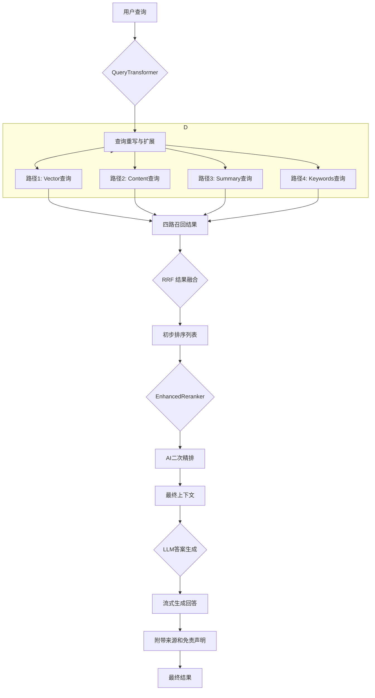

# Smart RAG 系统架构文档

## 1. 核心设计理念

本系统的架构设计遵循三大核心理念：

- **模块化 (Modularity)**：系统的每个核心功能（如文档处理、检索、重排）都被封装在独立的、可替换的组件中。这使得系统易于维护、测试和升级。例如，可以轻松替换`AdvancedFusionRetriever`中的某个召回路径，或更换`EnhancedReranker`背后的大模型，而无需改动整体流程。
- **异步化 (Asynchronicity)**：整个后端服务基于`FastAPI`构建，所有I/O密集型操作（如API调用、数据库读写）均采用`async/await`实现。这使得系统能够高效地处理大量并发请求，在等待外部服务（如LLM API）响应时不会阻塞，从而最大化了系统的吞吐量和响应速度。
- **可配置性 (Configurability)**：系统的关键行为，特别是检索策略，是高度可配置的。通过`advanced_config.py`等配置文件，开发者可以轻松地调整不同检索路径的权重、启用或禁用特定功能，以适应不同的应用场景（如追求速度、追求召回率等），而无需修改代码。

## 2. 核心工作流

系统包含两大核心工作流：**知识入库流程**和**检索问答流程**。

### 2.1. 知识入库流程 (Ingestion Flow)

此流程负责将用户上传的原始文档，处理成可供检索的、包含多维度表征的知识单元。

```mermaid
flowchart TD
    A[用户上传PDF文档] --> B{EnhancedPDFProcessor};
    B --> C[解析与内容提取<br>(文本, 表格等)];
    C --> D{MedicalTextSplitter};
    D --> E[双模智能分块<br>(语义/递归)];
    E --> F[生成文档块 Chunks];
    F --> G{元数据生成模块};
    G --> H[提取关键词<br>Keywords];
    G --> I[生成摘要<br>Summary];
    F --> J[向量化<br>Vectorize];
    subgraph K [存入ChromaDB]
        direction LR
        J --> L[向量 Vector];
        F --> M[原文 Content];
        H --> N[关键词 Keywords];
        I --> O[摘要 Summary];
    end
    L & M & N & O --> P[处理完成];
```

### 2.2. 检索问答流程 (Query Flow)

当用户发起查询时，系统会启动一个实时的、多阶段的RAG链条来生成答案。



## 3. 模块化组件详解

系统的代码结构清晰地反映了其模块化的设计思想。以下是核心目录及其职责：

- **`app/main.py`**: FastAPI应用的入口，负责初始化服务、配置中间件和生命周期管理。

- **`app/services/`**: 业务服务层，封装了高层次的业务逻辑。
  - `DocumentService`: 处理文档的上传、处理状态跟踪和存储。
  - `ChatService`: 协调整个问答流程，管理用户会话。

- **`app/processors/`**: 原始文档处理模块。
  - `EnhancedPDFProcessor`: 负责解析PDF，提取文本、表格等结构化内容。

- **`app/embeddings/`**: 文本分块与向量化模块。
  - `MedicalTextSplitter`: 核心调度器，根据配置选择使用`HybridTextSplitter`进行语义分块，或降级到稳定的递归分块。

- **`app/metadata/`**: 元数据生成模块，在知识入库时为文本块生成更丰富的表征。
  - `summarizers/LightweightSummaryGenerator`: 调用大模型API为文本块生成摘要。
  - `extractors/KeybertExtractor`: 使用KeyBERT等模型为文本块提取关键词。

- **`app/retrieval/`**: **系统的核心RAG引擎**，负责从知识库中检索信息。
  - `QueryTransformer`: 在检索前，使用LLM对查询进行重写和扩展。
  - `AdvancedFusionRetriever`: 实现四路召回（`VECTOR`, `CONTENT`, `SUMMARY`, `KEYWORDS`）并使用RRF算法进行结果融合。
  - `EnhancedReranker`: 在检索后，使用更强大的AI模型对融合结果进行二次精排。

- **`app/storage/`**: 数据存储层。
  - `database.py`: 使用SQLAlchemy管理MySQL/PostgreSQL数据库，存储文档元数据、会话历史等。
  - `vector_store.py`: `VectorStore`类，封装了与`ChromaDB`的所有交互，负责向量的存储和检索。

- **`app/workflow/`**: 工作流与LLM客户端。
  - `EnhancedRAGWorkflow`: 编排完整的RAG链条，从接收查询到最终生成答案。
  - `deepseek_client.py`, `qianwen_client.py`: 封装了与不同LLM服务API的交互逻辑。

## 4. 技术栈

| 分类 | 技术/库 | 用途 |
| :--- | :--- | :--- |
| **后端框架** | FastAPI | 高性能异步Web服务。 |
| **数据校验** | Pydantic | API数据模型定义与校验。 |
| **数据库ORM** | SQLAlchemy | 与SQL数据库（MySQL/PostgreSQL）交互。 |
| **向量数据库** | ChromaDB | 存储和检索文档向量。 |
| **异步任务队列** | Celery | 处理耗时的离线任务，如文档处理、元数据生成。 |
| **文档解析** | unstructured | 解析PDF等复杂文档格式。 |
| **文本分块** | 自研 (`MedicalTextSplitter`) | 实现双模（语义/递归）智能文本分块。 |
| **关键词提取** | KeyBERT, Jieba | 从文本中提取关键词。 |
| **LLM/Embedding** | DeepSeek, Qianwen | 用于答案生成、查询转换、摘要生成和文本向量化。 |
| **前端框架** | React, Vite, MUI | 构建现代化、响应式的用户界面。 |
| **容器化** | Docker, Docker Compose | 用于开发和部署。 |

## 5. 数据模型

系统的数据流转由一系列严格定义的Pydantic模型驱动，确保了类型安全和数据一致性。

- **`Document`**: 定义了文档的基本属性，如ID、文件名、处理状态、元数据等。
- **`Chunk`**: 代表分块后的文本单元，包含内容和来源等元数据。
- **`QueryRequest`**: API接收的查询请求模型，包含`query`和`session_id`。
- **`QueryResponse`**: 返回给前端的响应模型，包含答案、来源文档、处理时间等。
- **`DocumentMetadata`**: 包含为每个文档块生成的丰富元数据，如`summary`, `keywords`等。

## 6. 未来方向

- **知识图谱集成**: 引入知识图谱作为第五路召回，提升对实体和关系的理解能力。
- **检索策略自优化**: 基于用户反馈，利用强化学习自动调整`AdvancedFusionRetriever`中的融合权重。
- **多模态RAG**: 将文档中的表格和图片进行独立处理和索引，实现真正的多模态问答。
- **可观测性**: 引入OpenTelemetry等工具，实现对RAG链条中每一步的精细化监控与追踪。
