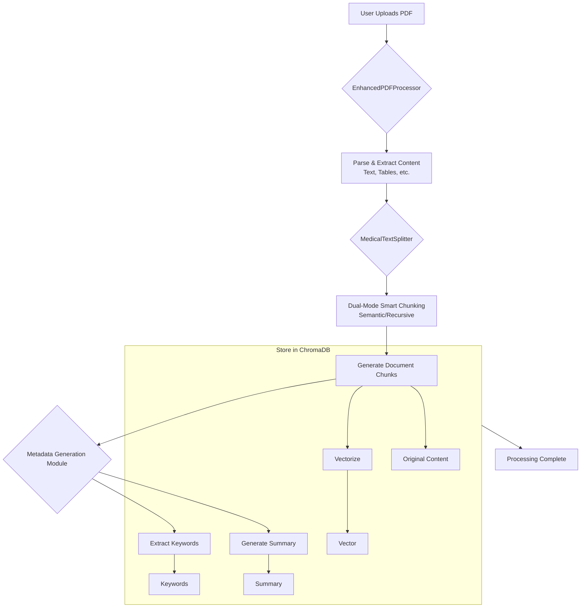
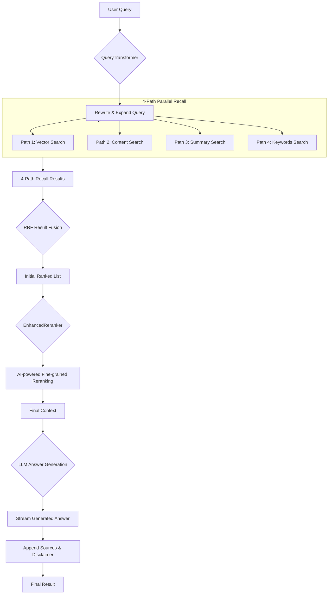

# Smart RAG System Architecture

## 1. Core Design Philosophy

This system's architecture is guided by three core principles:

- **Modularity**: Each core function of the system (e.g., document processing, retrieval, reranking) is encapsulated in independent, replaceable components. This makes the system easy to maintain, test, and upgrade. For example, a recall path in the `AdvancedFusionRetriever` or the large model behind the `EnhancedReranker` can be easily replaced without altering the overall workflow.
- **Asynchronicity**: The entire backend service is built on `FastAPI`, and all I/O-intensive operations (like API calls, database reads/writes) are implemented using `async/await`. This allows the system to efficiently handle a large number of concurrent requests, preventing blocking while waiting for external services (like LLM APIs) and thus maximizing system throughput and responsiveness.
- **Configurability**: The system's key behaviors, especially its retrieval strategies, are highly configurable. Through configuration files like `advanced_config.py`, developers can easily adjust the weights of different retrieval paths and enable or disable specific features to adapt to various application scenarios (e.g., prioritizing speed vs. recall) without changing the code.

## 2. Core Workflows

The system includes two main workflows: the **Ingestion Flow** and the **Query Flow**.

### 2.1. Ingestion Flow

This workflow is responsible for processing raw documents uploaded by the user into structured knowledge units with multi-dimensional representations, ready for retrieval.

### 2.2. Query Flow

When a user submits a query, the system initiates a real-time, multi-stage RAG chain to generate an answer.

## 3. Modular Component Deep Dive

The system's code structure clearly reflects its modular design philosophy. Here are the core directories and their responsibilities:

- **`app/main.py`**: The entry point for the FastAPI application, responsible for initializing services, configuring middleware, and managing the application lifecycle.

- **`app/services/`**: The business service layer, encapsulating high-level business logic.
  - `DocumentService`: Handles document uploads, processing status tracking, and storage.
  - `ChatService`: Coordinates the entire Q&A workflow and manages user sessions.

- **`app/processors/`**: The raw document processing module.
  - `EnhancedPDFProcessor`: Responsible for parsing PDFs and extracting structured content like text and tables.

- **`app/embeddings/`**: The text chunking and vectorization module.
  - `MedicalTextSplitter`: The core dispatcher that, based on configuration, selects `HybridTextSplitter` for semantic chunking or falls back to stable recursive chunking.

- **`app/metadata/`**: The metadata generation module, which creates richer representations for text chunks during ingestion.
  - `summarizers/LightweightSummaryGenerator`: Calls large model APIs to generate summaries for text chunks.
  - `extractors/KeybertExtractor`: Uses models like KeyBERT to extract keywords from text chunks.

- **`app/retrieval/`**: **The core RAG engine of the system**, responsible for retrieving information from the knowledge base.
  - `QueryTransformer`: Uses an LLM to rewrite and expand queries before retrieval.
  - `AdvancedFusionRetriever`: Implements the 4-path recall (`VECTOR`, `CONTENT`, `SUMMARY`, `KEYWORDS`) and uses the RRF algorithm for result fusion.
  - `EnhancedReranker`: Uses a more powerful AI model to perform a second-pass fine-grained reranking of the fused results.

- **`app/storage/`**: The data storage layer.
  - `database.py`: Manages the MySQL/PostgreSQL database using SQLAlchemy for storing document metadata, session history, etc.
  - `vector_store.py`: The `VectorStore` class, which encapsulates all interactions with `ChromaDB` for vector storage and retrieval.

- **`app/workflow/`**: The workflow and LLM client module.
  - `EnhancedRAGWorkflow`: Orchestrates the complete RAG chain, from receiving a query to generating the final answer.
  - `deepseek_client.py`, `qianwen_client.py`: Encapsulate the interaction logic with different LLM service APIs.

## 4. Technology Stack

| Category                | Technology/Library          | Purpose                                                 |
| :---------------------- | :-------------------------- | :------------------------------------------------------ |
| **Backend Framework**   | FastAPI                    | High-performance asynchronous web services.             |
| **Data Validation**     | Pydantic                    | API data model definition and validation.               |
| **Database ORM**        | SQLAlchemy                  | Interaction with SQL databases (MySQL/PostgreSQL).      |
| **Vector Database**     | ChromaDB                    | Storage and retrieval of document vectors.              |
| **Async Task Queue**    | Celery                      | Handling time-consuming offline tasks like document processing. |
| **Document Parsing**    | unstructured                | Parsing complex document formats like PDF.              |
| **Text Chunking**       | Custom (`MedicalTextSplitter`) | Dual-mode (semantic/recursive) smart text chunking.     |
| **Keyword Extraction**  | KeyBERT, Jieba              | Extracting keywords from text.                          |
| **LLM/Embedding**       | DeepSeek, Qianwen           | Answer generation, query transformation, summarization, and vectorization. |
| **Frontend Framework**  | React, Vite, MUI            | Building a modern, responsive user interface.           |
| **Containerization**    | Docker, Docker Compose      | For development and deployment.                         |

## 5. Data Models

The system's data flow is driven by a series of strictly defined Pydantic models, ensuring type safety and data consistency.

- **`Document`**: Defines the basic properties of a document, such as ID, filename, processing status, metadata, etc.
- **`Chunk`**: Represents a chunked text unit, containing content and source metadata.
- **`QueryRequest`**: The request model for API queries, containing `query` and `session_id`.
- **`QueryResponse`**: The response model returned to the frontend, containing the answer, source documents, processing time, etc.
- **`DocumentMetadata`**: Contains the rich metadata generated for each document chunk, such as `summary`, `keywords`, etc.

## 6. Future Directions

- **Knowledge Graph Integration**: Introduce a knowledge graph as a fifth recall path to enhance understanding of entities and relationships.
- **Self-Optimizing Retrieval Strategy**: Use reinforcement learning based on user feedback to automatically adjust the fusion weights in `AdvancedFusionRetriever`.
- **Multi-modal RAG**: Independently process and index tables and images from documents to enable true multi-modal Q&A.
- **Observability**: Introduce tools like OpenTelemetry to achieve fine-grained monitoring and tracing of every step in the RAG chain.
